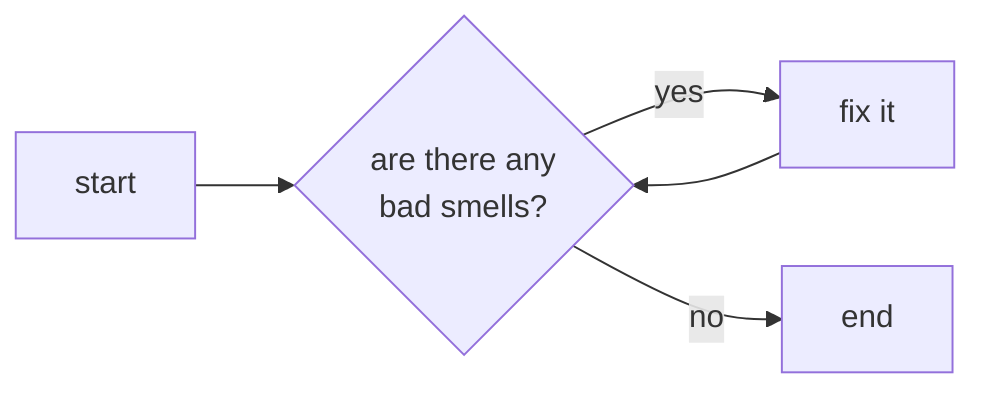

# The Riddles of Gollum!
## Episode #001 - A whole mess

Welcome to "Gollum's Riddles". If you haven't been here before, this is a place where programming problems of different types will be proposed to be solved.

Without further ado, we leave you with the next problem. 

Good luck adventurers!

## Statement

On this occasion, we will choose a well-known exercise. It is the *"Movie Rental"* proposed by ***Martin Fowler*** in his book *"Refactoring: Improving the Design of Existing Code"*.

We will not modify the original statement:
> The sample program is very simple. It is a program to calculate and print a statement of a customer’s charges at a video store. The program is told which movies a customer rented and for how long. It then calculates the charges, which depend on how long the movie is rented, and identifies the type movie. There are three kinds of movies: regular, children’s, and new releases. In addition to calculating charges, the statement also computes frequent renter points, which vary depending on whether the film is a new release.

## Objetive

As you can see, this is a **refactoring exercise**. We are given part of a first program in which we will have to look for ways to improve it. For this we will have to base ourselves on chapter 3 (*"Bad Smells in Code"*) of the mentioned book.

Iterate the following flow until you are happy with the result and think there is no more to do:

## Comments

As the example itself says:
> *What are your impressions about the design of this program? I would describ eit as not well designed and certainly not object oriented. For a simple program like this, that does not really matter. There’s nothing wrong with a quick and dirty simple program. But if this is a representative fragment of a more complex system, then I have some real problems with this program. That long statement routine in the Customer class does far too much. Many of the things that it does should really be done by the other classes.*

## References

- Book: **Fowler, Martin. (1999).** *Refactoring: Improving the Design of Existing Code (1st ed.)* **. Addison Wesley Longman, Inc**
